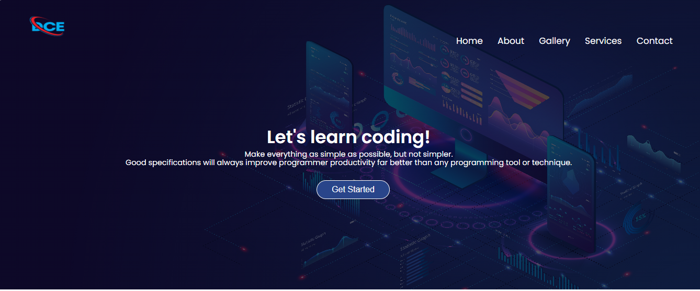

DCE website

A simple website built using HTML and CSS to help students choose a suitable programming language for themselves.

 *Visuals
 

⭐Features:
1. Access to Programming languages
2. Basic knowledge of computer
3. Services
4. Clean footer
