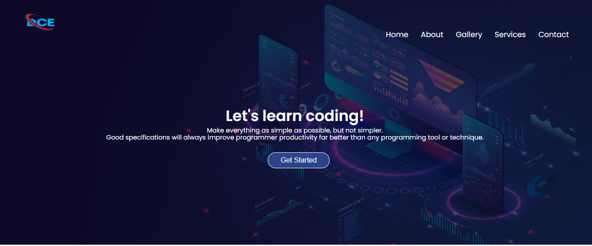

# DCE Website

A modern and user-friendly platform designed to provide students with access to different opportunities, resources, updates, and educational content in one place.

---

## 🌟 Features
* Quick access to numerous programming languages.
* 🎓 Educational resources and study materials
* 📰 Informative blog or update section
* 📱 Responsive design for mobile and desktop
* ⚡ Fast and clean user interface
* 🔍 Easy navigation and organized content

---

## 🛠️ Tech Stack

* **HTML5**
* **CSS3**
* **JavaScript**

---

## 📂 Project Structure

```bash
DCE-Website/
│
├── new.html
├── style-wrapper.css
├── script.js
├── assets/
│   ├── images/
│   └── icons/
└── README.md
```

## 💡 Purpose of the Project

The main goal of this project is to create a centralized platform where students can discover several programming languages their learning resources easily. It was developed to improve accessibility to learning materials.

---

## 📸 Screenshots

```markdown

```

---

## 🔮 Future Improvements

* Add backend integration
* User authentication system
* Search and filter functionality
* Admin dashboard for posting updates
* Dark mode support

---

## 🤝 Contributing

Contributions, suggestions, and feedback are always welcome.

1. Fork the repository
2. Create a new branch
3. Make your changes
4. Submit a pull request

---

## 👨‍💻 Author

Developed by **Roji Mijar**

* GitHub: [https://github.com/your-username](https://github.com/Rojimijar1)
* LinkedIn: [https://linkedin.com/in/your-profile](https://linkedin.com/in/your-profile)

---

⭐ If you like this project, consider giving it a star on GitHub!
